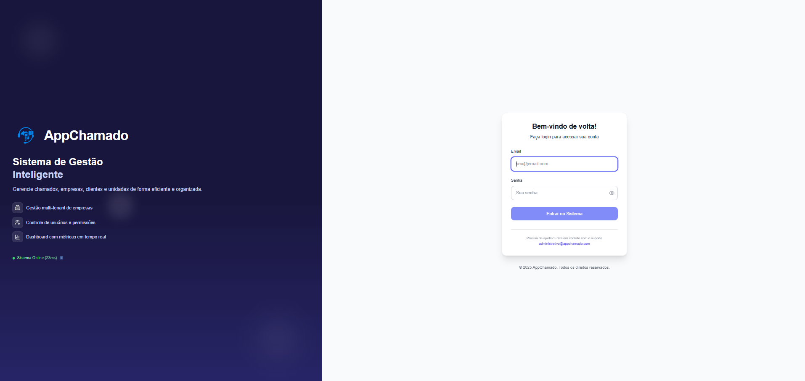
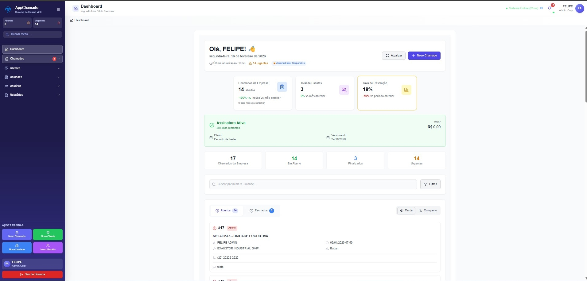
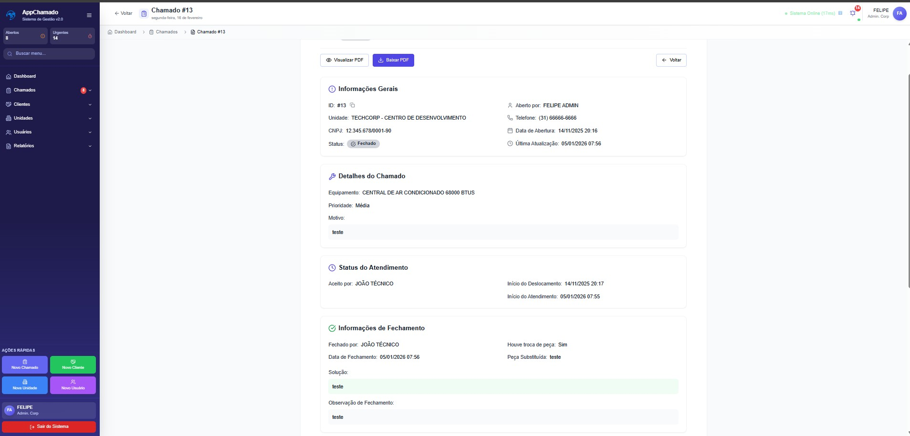
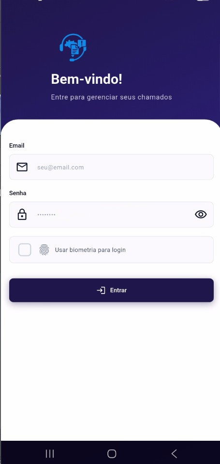
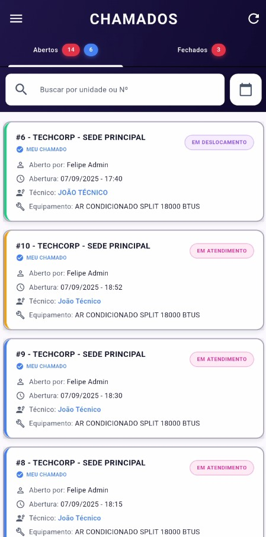
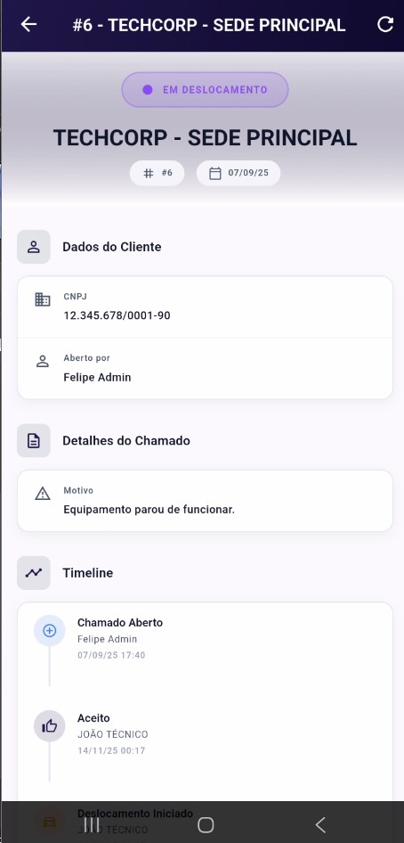
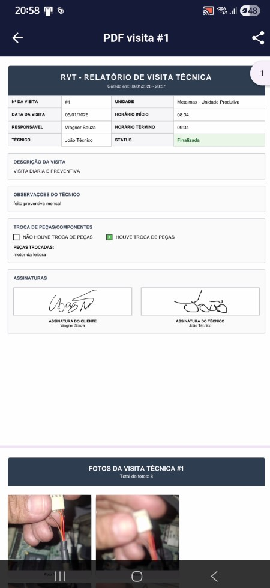

# App Chamado — Case

Sistema completo de gestão de chamados com **painel web** e **app do técnico**.

## Principais recursos
- Cadastro de clientes, unidades, usuários e demandas
- Abertura de chamados por equipamento/unidade/motivo/urgência
- App (Flutter) com notificações e status do atendimento
- Fotos no atendimento e geração automática de PDF
- Atualização **em tempo real** no painel web via **WebSocket**

## Links
- Site: https://appchamado.com
- LinkedIn: https://www.linkedin.com/in/matheusaraujotecnicotiemanutencao

## Stack (alto nível)
- Web: React + TypeScript
- Mobile: Flutter
- API: NestJS 10 + Fastify + Prisma
- Tempo real: WebSocket
- Relatórios: PDF

## Screenshots

